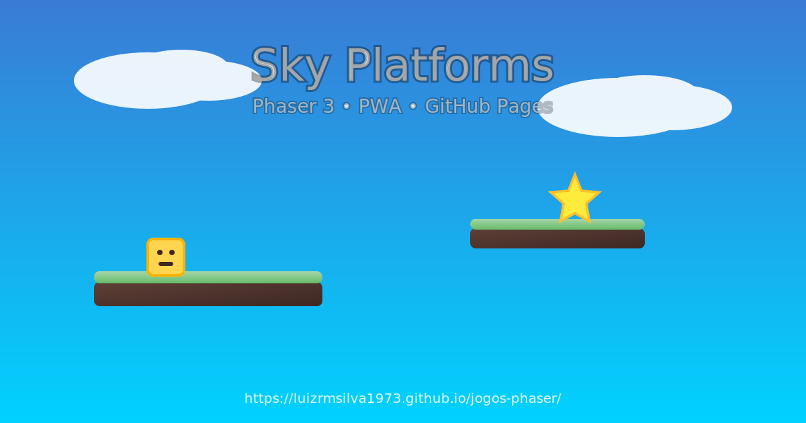

<div align="center">

# Sky Platforms — Phaser 3

Jogo de plataforma 2D, rápido, responsivo e instalável (PWA).

[](https://github.com/LuizRMSilva1973/jogos-phaser/actions/workflows/deploy-pages.yml)
[](https://github.com/LuizRMSilva1973/jogos-phaser/actions/workflows/release.yml)

🎮 Jogue agora: https://luizrmsilva1973.github.io/jogos-phaser/

</div>

<p align="center">
  
  <br/>
  <em>Sky Platforms — Phaser 3 • PWA • GitHub Pages</em>
  <br/><br/>
</p>

## Destaques
- Física arcade com pulos, colisões e coleta de estrelas
- Bombas reativas quando o nível é limpo (desafio crescente)
- Telas: Menu, Jogo, Placar e Enviar Pontuação
- Placar local via API simples (`/api/scores`) com persistência em `scores.json`
- PWA (manifest + service worker): instalável e cache básico
- Responsivo para desktop e mobile (teclado e toque)
- Seletor de jogos inicial (GameSelector) — pronto para múltiplos jogos
- Painel de assinatura (“Acesso Total”) com pagamento Stripe e verificação local (30 dias)

## Como jogar
- Teclado: ← → para mover, ↑ ou Espaço para pular, `P` para pausar
- Toque: botões virtuais exibidos no mobile
- Colete estrelas para pontuar; ao limpar o nível, bombas aparecem — desvie!

## Executar localmente
```
npm install
npm run start:5173
# Abra http://localhost:5173
```
Escolha outra porta se preferir: `npm run start:8081`.

## API do placar
- GET `/api/scores?gameId=sky` → Retorna top 10 do jogo (ordenado)
- POST `/api/scores` → `{ name: string, score: number, gameId: string }`
  - Os dados ficam em `scores.json` na raiz do projeto

## Assinatura Acesso Total (Stripe)
- Painel: `painel.html` — abre o checkout e mostra o status da assinatura.
- Payment Link: https://buy.stripe.com/8x2bJ26MB7xmftZe5t2VG02
- Fluxo:
  1. Acesse `painel.html` (produção ou local).
  2. Clique em “Assinar Acesso Total” e conclua o pagamento Stripe.
  3. Após voltar em `painel.html?status=ok`, o painel salva 30 dias no `localStorage`.
  4. Abra os jogos pelos cards ou via `index.html?game=sky` / `index.html?game=runner`.
- O botão “Já paguei! Ativar acesso” força a ativação local (útil para testes/offline).
- Cada jogo chama `hasActiveSubscription()` antes de iniciar; se expirado, redireciona ao painel.

## Estrutura
- `index.html` — Entrada e boot do jogo
- `painel.html` — Painel da plataforma com status da assinatura e cards dos jogos
- `styles.css` — Estilo da página, canvas e painel
- `lib/phaser.min.js` — Phaser 3 local
- `src/main.js` — Configuração base (tamanho, física, cenas)
- `src/scenes/*` — Cenas: Boot, Menu, Game, Scoreboard, SubmitScore
- `src/subscription.js` — Funções de assinatura (`saveSubscription`, `hasActiveSubscription`, `requireSubscription`)
- `src/games.js` — Catálogo de jogos usado pelo seletor/painel
- `server.js` — Servidor Express + endpoints do placar
- `manifest.webmanifest` e `sw.js` — PWA

## Deploy
- GitHub Pages: automatizado via Actions a cada push na `main`.
- Hostinger (Node + Nginx + HTTPS + Stripe): siga docs/DEPLOY_HOSTINGER.md

## Roadmap (idéias)
- Mais fases, inimigos e power-ups
- Efeitos sonoros e trilha
- Leaderboard global (servidor remoto)

—
Se curtir, marque a ⭐ e compartilhe. Sugestões são bem-vindas!
